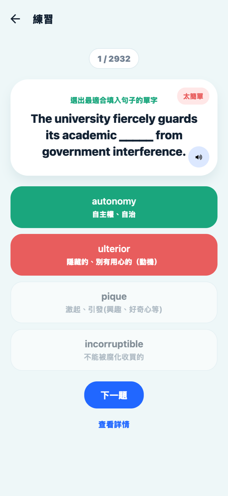
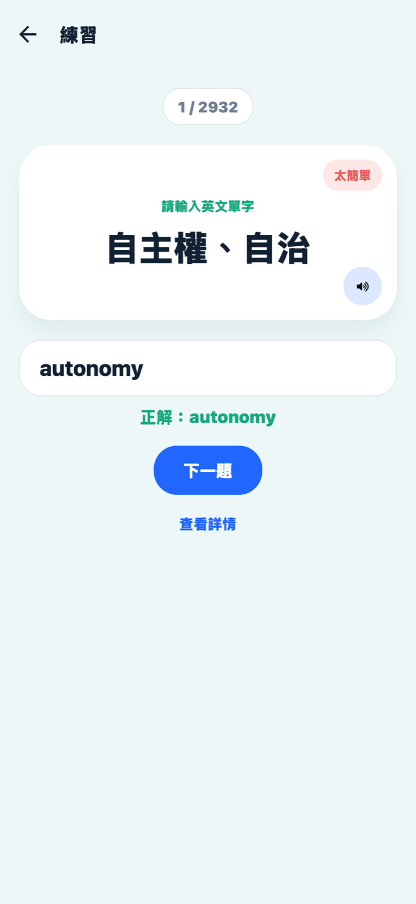
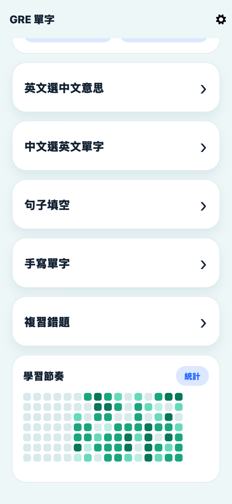
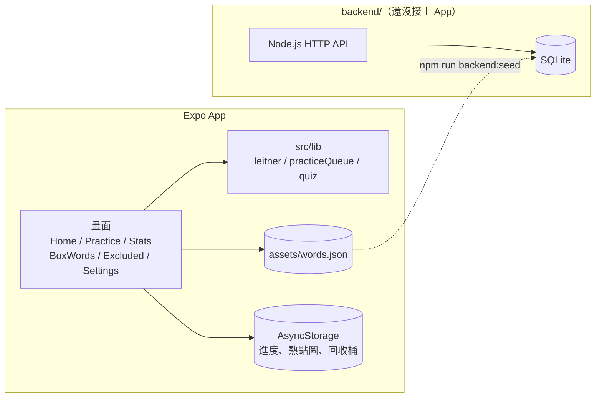

# GRE 單字

> A GRE vocabulary app built with Expo and React Native, using Leitner spaced repetition with all progress stored on the device.

準備 GRE 的人可以用這個 App 每天複習單字，題型有選擇題、句子填空和手寫拼字。答對的字會隔幾天才再出現，答錯的字隔天再考。內建 3192 個單字，不用登入，進度存在手機上。

[](https://docs.expo.dev/versions/v54.0.0/)


## 功能

### 練習方式

首頁可以先選字母範圍和出題順序，再從下面五個入口開始練習。

| 入口 | 題目顯示 | 作答方式 |
|---|---|---|
| 英文選中文意思 | 英文單字 | 從四個中文意思選一個 |
| 中文選英文單字 | 中文意思 | 從四個英文單字選一個 |
| 句子填空 | 挖掉單字的英文範例句 | 從四個英文單字選一個 |
| 手寫單字 | 中文意思 | 自己拼出英文單字 |
| 複習錯題 | 中文意思，只出答錯後還沒再答對的字 | 從四個英文單字選一個 |

選擇題的另外三個選項是從單字庫裡隨機抽其他字，所以每個選項都是真的單字或真的中文意思。答完之後，每個選項底下會標出它對應的單字或意思，選錯的那個選項到底是什麼字也看得到（預設開啟，可以在設定頁關掉）。

<p align="center">
  
  
  
</p>

### 答完看範例句、翻譯與字根

答題後按「查看詳情」，會展開英文範例句（題目單字用橘色標出）、範例句的中文翻譯，以及字根字尾的拆解。題目卡右下角的喇叭按鈕用 expo-speech（呼叫手機內建的文字轉語音）念出單字，App 裡不需要放錄音檔。設定頁可以改成答完就自動展開詳情。

### Leitner 盒子排程

排程用的是 Leitner system（萊特納卡片盒，依答對次數拉長複習間隔的方法）。每個字都放在 1 到 5 號盒子裡，盒子號碼越大，隔越久才會再考。

| 盒子 | 移進這個盒子後，隔幾天再出現 |
|---|---|
| 1 | 1 天 |
| 2 | 2 天 |
| 3 | 4 天 |
| 4 | 7 天 |
| 5 | 14 天 |

舉例來說，今天第一次練到 `abate` 並且答對，它會從盒子 1 升到盒子 2，兩天後才會回到待複習清單。之後每答對一次就往後移一盒，到了盒子 5 就固定 14 天出現一次。只要答錯一次，不管原本在第幾盒都會掉回盒子 1，隔天再考。

五種練習入口共用同一份進度，同一個字換個題型考，盒子也不會重算。「統計」頁會列出每一盒目前有幾個字，點進盒子可以把單字手動移到別的盒子，或清掉這個字的進度。

### 其他功能

- **範圍與順序**：只練某幾個字母開頭的字，順序可選 A 到 Z 或打亂。
- **太簡單的字**：題目卡右上角的「太簡單」會把這個字移進回收桶，之後不再排進複習；到回收桶按「恢復」就能放回來。
- **學習熱點圖**：首頁用類似 GitHub 貢獻圖的格子畫出最近 16 週每天答了幾題，答得越多顏色越深。

<p align="center">
  
</p>

## 單字資料

單字庫放在 `assets/words.json`，打包進 App 裡，沒有網路也能練。每個字有這些欄位：

| 欄位 | 內容 | 範例 |
|---|---|---|
| `word` | 英文單字 | `abandon` |
| `pos` | 詞性 | `v.` |
| `meaning` | 中文意思 | 拋棄、遺棄 |
| `example` | 英文範例句 | Fearing the ship would sink, the crew was ordered to abandon it immediately. |
| `exampleZh` | 範例句的中文翻譯 | 由於擔心船會沉沒，船員被命令立即棄船。 |
| `roots` | 字根字尾說明 | a- (加強/離開) + bandon (源自古法文 bandon，控制權) → 放棄控制、棄之不顧 |

這份資料在開發階段用 `scripts/` 裡的腳本一次產生，App 執行時不會再上網抓資料。

1. `parse-wordlist.js` 從 GRE 字彙講義 PDF 轉出的純文字裡抓出單字候選。
2. 分批用 AI 補上詞性、範例句和字根說明，每批存成 `data/words/*.json`。
3. `validate-words.js` 檢查必填欄位、單字格式、重複的字，以及範例句裡有沒有出現這個字。
4. `merge-batches.js` 合併所有批次、再驗證一次，輸出 `assets/words.json`。
5. `fill-example-zh.js` 用 Google 翻譯補上範例句的中文翻譯。

範例句與字根說明經過 AI 生成或改寫，中文翻譯是機器翻譯，內容可能有錯。

## 技術架構

| 部分 | 使用的技術 | 用途 |
|---|---|---|
| App 框架 | Expo SDK 54、React Native 0.81、React 19、TypeScript | iOS 與 Android 共用一份程式碼 |
| 畫面切換 | React Navigation | 在首頁、練習、統計、盒子、回收桶、設定六個畫面之間切換 |
| 本機儲存 | AsyncStorage（App 在手機上存小筆資料的地方） | 單字進度、熱點圖、回收桶、錯題、設定 |
| 發音 | expo-speech | 念出英文單字 |
| 大頭貼 | expo-image-picker | 設定頁從相簿選照片 |
| 測試 | Jest（jest-expo） | 排程計算、出題、練習佇列、儲存讀寫 |
| 後端（還沒接上 App） | Node.js 內建 `http` 模組、SQLite（整個資料庫就是一個檔案） | 帳號、進度同步、單字管理 API |



`src/lib/` 裡是跟畫面無關的邏輯：`leitner.ts` 算下一次複習日期，`practiceQueue.ts` 依範圍、回收桶和錯題清單排出今天要考的字，`quiz.ts` 產生選擇題選項。這幾個檔案都有對應的 Jest 測試。

`backend/` 是為了之後上架準備的 API，內容包含帳號註冊與登入、個人資料與設定、每個使用者的單字進度，還有一個 `/admin` 單字管理頁。密碼會先混入 salt（每個帳號各自產生的隨機字串），再用 PBKDF2（把密碼反覆雜湊很多次，讓暴力破解變慢）處理後儲存，登入後發的 token（代表使用者身分的一串憑證）在資料庫裡也只存雜湊值。後端直接呼叫系統的 `sqlite3` 指令存取資料庫，沒有另外裝資料庫套件。目前 App 只讀寫手機上的資料，還沒有打這組 API；設定頁的帳號信箱、密碼、Google 綁定和通知開關也只有畫面，還沒有接上實際功能。完整 API 清單在 [backend/README.md](backend/README.md)，正式上線改用 Neon Postgres（雲端託管的 PostgreSQL 資料庫）的規劃在 [docs/neon-postgres-plan.md](docs/neon-postgres-plan.md)。

## 本機跑起來

需要 Node.js 20.19.4 以上。

```bash
git clone https://github.com/hsuiris/gre-vocab.git
cd gre-vocab
npm install
npx expo start
```

終端機出現 QR code 之後，用手機上的 Expo Go（Expo 官方的開發測試用 App）掃描就能打開，Expo Go 的版本要支援 SDK 54。有裝模擬器的話，在終端機按 `i` 開 iOS 模擬器、按 `a` 開 Android 模擬器。

想在瀏覽器裡看，要先補裝網頁版需要的套件：

```bash
npx expo install react-dom react-native-web @expo/metro-runtime
npm run web
```

單元測試用下面這行指令跑。

```bash
npm test
```

### 後端（選用）

後端會呼叫系統的 `sqlite3` 指令，先用 `sqlite3 --version` 確認電腦裡有裝。

```bash
npm run backend:migrate   # 建立資料表
npm run backend:seed      # 把 assets/words.json 匯入資料庫
npm run backend:start     # 啟動 API，網址是 http://localhost:3001
npm run backend:test      # 用暫存資料庫跑一輪 API 測試
```

資料庫預設是 `data/app.db`，要換位置就設定環境變數 `DB_PATH`。管理員帳號只能從指令列建立，公開的註冊 API 一律建立一般使用者：

```bash
npm run backend:create-admin -- 你的信箱 你的密碼 顯示名稱
```

建好之後到 `http://localhost:3001/admin` 管理單字。

## 專案結構

```text
gre-vocab/
├── App.tsx               # 進入點，掛上 RootNavigator
├── src/
│   ├── screens/          # 首頁、練習、統計、盒子、回收桶、設定
│   ├── components/       # 題目卡、熱點圖、首頁吉祥物
│   ├── lib/              # Leitner 排程、練習佇列、出題、AsyncStorage 讀寫
│   ├── navigation/       # React Navigation 設定
│   ├── data/words.ts     # 載入單字庫並定義型別
│   └── theme.ts          # 顏色與陰影
├── assets/words.json     # 單字庫
├── __tests__/            # App 的 Jest 測試
├── scripts/              # 產生與驗證單字資料的腳本
├── data/                 # 單字批次檔、中間產物、SQLite 資料庫
├── backend/              # Node.js API（還沒接上 App）
├── migrations/           # SQLite 資料表定義
└── docs/                 # 設計規格、實作計畫、Postgres 遷移規劃、截圖
```

## 授權

MIT，條文見 [LICENSE](LICENSE)。
