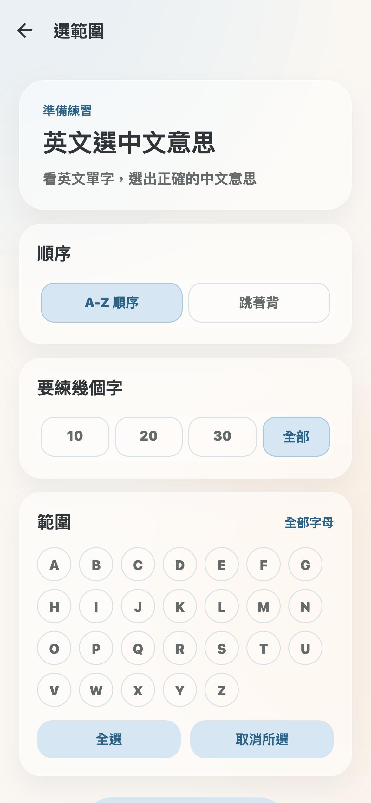
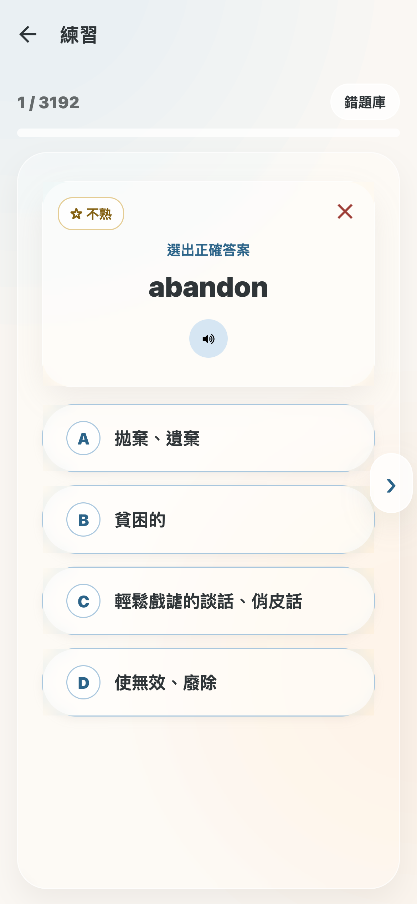
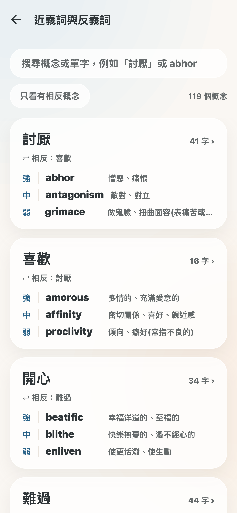
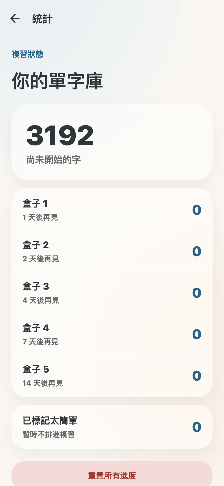
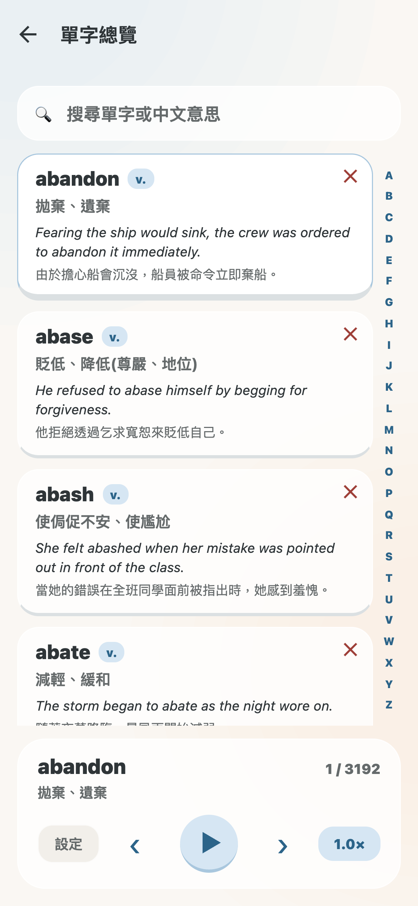

# GRE Vocab

> An offline-first GRE vocabulary app: 3,192 words, five drill modes, and 6,384 pre-recorded audio files.

背 GRE 單字的 App。3192 個字、五種練習模式、119 組概念分群，全部離線。發音是事先錄好的音檔，不靠手機內建語音，飛機上也能背。


## 為什麼做成離線

市面上的單字 App 多半在需要發音時才呼叫系統語音，結果是同一個字在不同手機唸得不一樣，沒網路時有些裝置根本不唸。這個 App 把 3192 個英文字和 3193 句中文解釋事先用 Edge 的類神經語音錄成 mp3 打包進去，發音固定、離線可用。

進度也全部存在裝置上，不需要註冊、不上傳任何東西。

## 功能

### 五種練習模式

英文選中文、中文選英文、句子填空、單字拼寫、複習錯題。每種都可以先選範圍再開始。

 

練習前可以指定順序（A 到 Z 或隨機）、題數（10、20、30 或全部）、字母範圍。答完會展開例句與字根說明。右上角的叉叉可以把太簡單的字丟進回收桶，之後不再出現。

### 概念分群：照意思找字，不是照字母

119 組中文概念把 3192 個字重新分群，其中 78 組有相反概念。每個字標上「強、中、弱」三級強度，例如「討厭」這組裡 abhor 是強、antagonism 是中、grimace 是弱。



這是照字母背最缺的一塊：知道 abhor 和 detest 都是討厭，但不知道哪個更重，寫作時就用錯。分群和強度是事先用 LLM 批次跑出來、再存成 JSON 打包進 App，執行時不呼叫任何 API。

### Leitner 五盒排程

答對往後一盒、答錯回第一盒，五個盒子的複習間隔是 1、2、4、7、14 天。統計頁看得到每盒各有幾個字。



### 單字總覽

3192 個字一次列出，可以勾選要聽的字循環播放，調語速（0.75、1、1.25 倍）、重複次數、要不要唸例句和中文。右側有可以拖的 A 到 Z 索引軸。



## 技術

| 項目 | 選擇 |
| --- | --- |
| App | Expo SDK 54 + React Native + TypeScript |
| 導覽 | React Navigation，11 個畫面 |
| 儲存 | AsyncStorage，六個鍵（進度、熱點圖、排除清單、設定、錯題、上次練習設定） |
| 語音 | 事先用 Edge neural voice 產生 mp3（`scripts/tts-build.js`），對照表在 `src/lib/recordings.ts` |
| 資料 | `assets/words.json`（3192 字）、`assets/concepts.json`（119 組概念） |
| 測試 | Jest，涵蓋概念資料一致性與畫面渲染 |

另有一套 `backend/`（Express + SQLite + JWT），是為了之後做雲端同步先寫的，目前 App 沒有接上去，跑起來也不影響 App。

## 跑起來

```bash
npm install
npm start        # Expo 開發伺服器
npm run ios      # iOS 模擬器
npm test         # 測試
```

網頁版可以用 `npx expo export --platform web` 匯出，但會把 1.6 GB 的音檔一起打包，建議只在需要截圖時用。

## 資料來源

單字清單整理自公開的 GRE 字表。例句、字根說明與概念分群是自己產生的，不是抄自任何一本書。

## 授權

MIT
